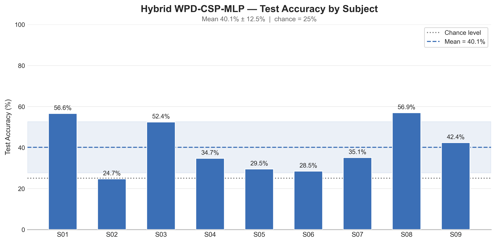
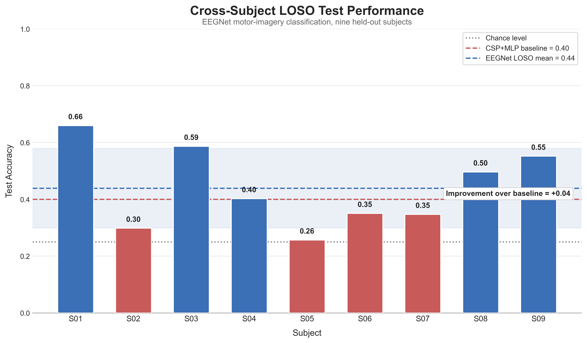

# Hybrid EEG Motor Imagery Classifier: WPD + CSP + MLP vs. EEGNet

[](#)
[](#)
[](#)
[](#)

A systematic, three-stage study of **cross-subject generalization** in EEG-based motor imagery classification — from a single-subject baseline, through Leave-One-Subject-Out (LOSO) evaluation of a hand-engineered pipeline, to an end-to-end deep learning approach with **EEGNet**.

## 📌 Overview

Motor imagery BCIs aim to classify which movement a person is *imagining* from EEG signals. The task is challenging because EEG is noisy, has a low signal-to-noise ratio, and varies substantially across individuals. This makes **inter-subject generalization** one of the main challenges for practical, calibration-free BCI systems.

This project began as a single-subject experiment (~77% accuracy on one individual) and evolved into a **three-notebook investigation** of this generalization problem.

Across the three notebooks, the same core question is examined with increasing methodological rigor:

> *If a model is trained on some subjects, how well can it classify motor imagery for a subject it has never seen before?*

Rather than optimizing for within-subject accuracy alone, this study evaluates how well each approach generalizes to unseen subjects under a consistent evaluation protocol.


| Approach                        | Validation Scheme         | Mean Cross-Subject Accuracy | vs. Chance (25%) |
| ------------------------------- | ------------------------- | --------------------------- | ---------------- |
| Subject-dependent (WPD+CSP+MLP) | Zero-calibration transfer | 31.7% ± 7.4%                | +6.7 pts         |
| LOSO Hybrid (WPD+CSP+MLP)       | 9-fold LOSO               | 40.1% ± 12.5%               | +15.1 pts        |
| **LOSO EEGNet (zero-shot)**     | 9-fold LOSO               | **43.9% ± 14.0%**           | **+18.9 pts**    |
| **LOSO EEGNet (fine-tuned)**    | LOSO + 50% calibration    | **47.6%**                   | **+22.6 pts**    |

> 📄 **Full methodology, derivations, and discussion:** **[Read the complete report →](doc/Report.pdf)**
>
> 📁 **Dataset & download instructions:** **[Access data & GDF files →](data/README.md)**
>
> 🔬 **EEGNet architecture reference:** **[View Braindecode documentation →](https://braindecode.org/1.4/generated/braindecode.models.EEGNet.html)**

---

## 🧬 The Core Problem: Inter-Subject Variability

A classifier calibrated on one person's EEG can learn spatial filters and decision boundaries that are closely tied to that individual's recording characteristics and neural response patterns. Differences in anatomy, electrode placement, and motor imagery strategy can therefore create a substantial **domain shift** between subjects.

When such a model is applied to a completely unseen subject with **zero calibration**, performance can approach chance level. This project measures the size of this generalization gap and evaluates whether multi-subject training and signal alignment can reduce it.

A dedicated pairwise transfer analysis illustrates the scale of the problem:

|                           | Within-Subject Accuracy | Cross-Subject Accuracy |
| ------------------------- | ----------------------: | ---------------------: |
| CSP + Logistic Regression |               **65.6%** |   **25.4%** (≈ chance) |

The large difference indicates that spatial filters learned from one subject's covariance structure do not transfer reliably to other subjects without additional adaptation.

---

## 📁 Project Structure

```text
Hybrid-EEG-Classifier-EEGNet/
├── data/
│   ├── raw/
│   └── README.md          # Subject info + dataset download instructions
├── doc/
│   └── Report.pdf         # Full methodology, results, and discussion
├── figures/
├── models/
├── notebooks/
│   ├── Hybrid-EEG-Classifier-WPD-CSP.ipynb        # Notebook 1
│   ├── Hybrid-EEG-Classifier-WPD-CSP-LOSO.ipynb   # Notebook 2
│   └── EEGNet-LOSO.ipynb                          # Notebook 3
├── results/
├── README.md
└── requirements.txt
```

---

## 📁 Dataset

All three notebooks use the **[BCI Competition IV, Dataset 2a](https://www.bbci.de/competition/iv/#dataset2a)** (Brunner et al., 2008): 9 subjects performing 4 balanced motor imagery tasks — left hand, right hand, feet, and tongue — recorded from 22 EEG and 3 EOG channels at 250 Hz.

| Subjects      | Classes                      | Trials / Subject         | Channels       | Sampling Rate |
| ------------- | ---------------------------- | ------------------------ | -------------- | ------------- |
| 9 (A01T–A09T) | Left / Right / Feet / Tongue | 288 (72/class, balanced) | 22 EEG + 3 EOG | 250 Hz        |

> 💡 The raw `.gdf` files are **not included** in this repository. See **[`data/README.md`](data/README.md)** for subject-specific details and download instructions before running the notebooks.

---

## 🔬 Three-Stage Experimental Pipeline

### 1️⃣ Notebook 1 — Subject-Dependent Baseline

📓 **[`notebooks/Hybrid-EEG-Classifier-WPD-CSP.ipynb`](notebooks/Hybrid-EEG-Classifier-WPD-CSP.ipynb)**

The original hybrid pipeline combines **Wavelet Packet Decomposition (WPD)**, **Filter-Bank Common Spatial Patterns (CSP)**, and a **PyTorch MLP**. It is trained and validated exclusively on Subject 1 (A01T), then applied to the remaining eight subjects without refitting.

* ✅ **Subject 1 performance:** **75.9%** test accuracy and **0.760** macro-F1.
* ❌ **Cross-subject performance:** **31.7% ± 7.4%** mean accuracy on unseen subjects, a **44-point gap** relative to the within-subject result. Subjects such as A06T and A09T remain close to the 25% chance level.

The purpose of this notebook is to establish a subject-dependent baseline and quantify the zero-calibration generalization gap.

### 2️⃣ Notebook 2 — LOSO Cross-Validation with the Hybrid Algorithm

📓 **[`notebooks/Hybrid-EEG-Classifier-WPD-CSP-LOSO.ipynb`](notebooks/Hybrid-EEG-Classifier-WPD-CSP-LOSO.ipynb)**

The same **WPD + CSP + MLP** pipeline is evaluated using a proper **Leave-One-Subject-Out (LOSO)** protocol. In each of the 9 folds, one subject is held out completely while the pipeline is refit from scratch using the remaining eight subjects.

**Euclidean Alignment** is also included as a leakage-free covariance-alignment step to reduce inter-subject differences.

* 📈 **Mean LOSO accuracy:** **40.1% ± 12.5%**
* This outperforms the **CSP + Logistic Regression** baseline (**38.2%**) and the unseen-subject average from Notebook 1.
* The improvement remains modest, highlighting the difficulty of learning a shared representation across heterogeneous subjects.

### 3️⃣ Notebook 3 — EEGNet with LOSO

📓 **[`notebooks/EEGNet-LOSO.ipynb`](notebooks/EEGNet-LOSO.ipynb)**

The final stage replaces the hand-engineered feature pipeline with **[EEGNet](https://braindecode.org/1.4/generated/braindecode.models.EEGNet.html)**, a compact end-to-end convolutional architecture designed for EEG decoding. It is evaluated under the same 9-fold LOSO protocol.

EEGNet learns temporal and spatial filters directly from the EEG signal rather than relying on explicitly engineered WPD and CSP features.

* **Best zero-shot cross-subject performance:** **43.9% ± 14.0%** mean LOSO accuracy, with Cohen's **κ = 0.252**.
* 🎯 **Subject-specific fine-tuning:** using 50% of the target subject's trials for 10 epochs increases mean accuracy to **47.6%**.

> ⚠️ **Hardware Constraint:** Training was performed on a CPU-only setup, so EEGNet was limited to **40 epochs** rather than the **300+ epochs** used as the recommended training budget. The model was therefore likely under-trained, and the reported result should be interpreted in that context.

---

## 📈 Results

> 📄 For full per-subject tables, per-class precision/recall/F1, confusion matrices, and the complete discussion, see the **[full project report](doc/Report.pdf)**.

### Final Cross-Subject Accuracy — All Three Notebooks

<table>
<tr>
<th align="center">Notebook 1<br>Subject-Dependent Baseline</th>
<th align="center">Notebook 2<br>LOSO Hybrid WPD-CSP-MLP</th>
<th align="center">Notebook 3<br>LOSO EEGNet</th>
</tr>
<tr>
<td></td>
<td></td>
<td></td>
</tr>
</table>

Across the three experiments, the overall trend is clear:

**single-subject training generalizes poorly → LOSO improves cross-subject performance → EEGNet provides the strongest zero-shot result.**

The fine-tuned EEGNet reaches **47.6% mean accuracy**, compared with the **25% chance level** for four-class classification. This improvement is encouraging, but the result should be interpreted alongside the constrained training budget and the substantial variability between subjects.

### The Domain-Shift Problem, Visualized

<p align="center">
  <br>
  <sub><b>Pairwise Transfer Heatmap (CSP + Logistic Regression).</b> Same-subject performance reaches as high as 0.83 (S03) and 0.80 (S08), with a mean of 65.6%. Cross-subject accuracy drops to a mean of 25.4%, illustrating the severity of the domain shift. S05 also has the lowest within-subject accuracy (0.46), indicating that it is a particularly difficult subject.</sub>
</p>

<br>

<p align="center">
  <br>
  <sub><b>CSP Spatial Patterns per WPD Sub-band (Subject 1).</b> Several CSP components do not show clean sensorimotor patterns centered around C3/C4. Instead, some capture frontal or posterior activity, suggesting that the learned spatial filters may contain non-motor variance — one possible contributor to the poor cross-subject generalization observed in Notebook 1.</sub>
</p>

### 🔊 A Note on Noisy Subjects

Subject difficulty is broadly consistent across the different pipelines:

* **S02** remains close to chance (**24.7%** hybrid LOSO, **29.9%** zero-shot EEGNet).
* **S05** is similarly difficult (**28.5%** hybrid LOSO, **25.7%** EEGNet) and shows no improvement from subject-specific fine-tuning.
* **S01** and **S08** are consistently among the easier subjects to generalize to, with EEGNet reaching **66.0%** on S01.

These patterns suggest that subject-level signal quality and variability play an important role in cross-subject decoding performance.

---

## 🔗 References

* Ang, K. K., Chin, Z. Y., Zhang, H., & Guan, C. (2008). *Filter Bank Common Spatial Pattern (FBCSP) in Brain-Computer Interface.* IEEE IJCNN.
* Brunner, C. et al. (2008). *BCI Competition 2008 – Graz Data Set A.*
* Ramoser, H., Müller-Gerking, J., & Pfurtscheller, G. (2000). *Optimal spatial filtering of single trial EEG during imagined hand movement.* IEEE Trans. Rehabilitation Engineering.
* Lawhern, V. J., Solon, A. J., Waytowich, N. R., Gordon, S. M., Hung, C. P., & Lance, B. J. (2018). *EEGNet: a compact convolutional neural network for EEG-based brain-computer interfaces.* Journal of Neural Engineering, 15(5), 056013. — [Architecture reference](https://braindecode.org/1.4/generated/braindecode.models.EEGNet.html)
* He, H., & Wu, D. (2020). *Transfer learning for brain-computer interfaces: A Euclidean space data alignment approach.* IEEE Trans. Biomedical Engineering, 67(2), 399–410.
* Gramfort, A. et al. (2013). *MEG and EEG data analysis with MNE-Python.* Frontiers in Neuroscience, 7, 267.

> 📄 For the complete derivations, per-fold tables, and full discussion behind every result in this README: **[Read the full project report →](doc/Report.pdf)**
