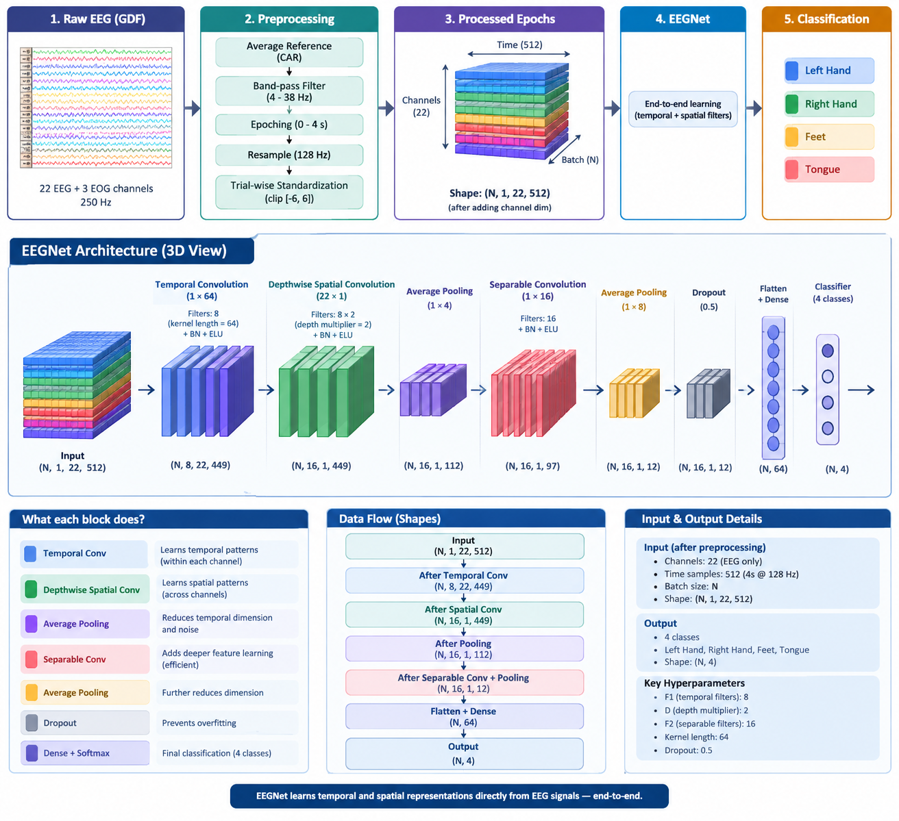

# 📓 Notebooks

This folder contains the three notebooks used for the motor imagery EEG experiments on the **BCI Competition IV-2a** dataset.

### 1. 🧪 Hybrid WPD + CSP + MLP

**[`Hybrid-EEG-Classifier-WPD-CSP.ipynb`](Hybrid-EEG-Classifier-WPD-CSP.ipynb)**

A subject-dependent baseline using:

**Wavelet Packet Decomposition → Filter-Bank CSP → MLP**

The model is trained on Subject 1 (A01T) and then evaluated on the remaining subjects without recalibration.

### 2. 🔄 LOSO Hybrid Pipeline

**[`Hybrid-EEG-Classifier-WPD-CSP-LOSO.ipynb`](Hybrid-EEG-Classifier-WPD-CSP-LOSO.ipynb)**

The same WPD + CSP + MLP pipeline is evaluated with **9-fold Leave-One-Subject-Out (LOSO)** cross-validation, including **Euclidean Alignment** for inter-subject covariance alignment.

### 3. 🧠 EEGNet LOSO

**[`EEGNet-LOSO.ipynb`](EEGNet-LOSO.ipynb)**

An end-to-end **EEGNet** model evaluated with the same LOSO setting. Instead of WPD/CSP features, EEGNet learns temporal and spatial representations directly from the preprocessed EEG.

#### EEGNet Architecture

  

<b>Figure.</b> Preprocessing pipeline and EEGNet architecture used in Notebook 3, from raw EEG recordings to four-class motor imagery prediction.

> 📄 For the full methodology and results, see the **[project report](../doc/Report.pdf)**.
